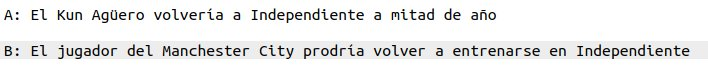

# headline_automation
This project is intended for automating the creation of article headlines using deep learning encode-decode architecture (seq2seq net trained with 60k sports news + 1B word2vec embedding)

Spanish Billion Words word2vec Embeddings linguistic resource: http://cs.famaf.unc.edu.ar/~ccardellino/SBWCE/SBW-vectors-300-min5.bin.gz

### *Article: https://goo.gl/r19kut*

### *Results:* 

PD: A-> human made;  B -> machine